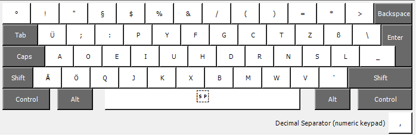
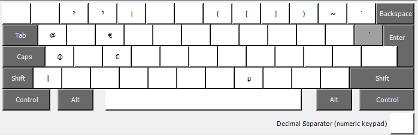
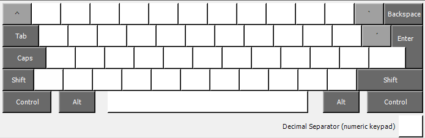

# dvorak-de-type-II
Windows keyboard layouts made with Microsoft Keyboard Layout Creator for the "Dvorak Typ II Deutsch" layout. 

## Disclaimer
I just did this for myself and if it helps you, great. Do with it whatever you like. 
But: I am not accepting contributions. 
I am not maintaining this other than what I need.  
I simply documented this so if I have to repeat the setup in about 5 years, I still know how it worked. 
And if it helps you on top of that: great!  
If you raise an issue in this repository asking for help, I might answer. But I don't expect anyone to need help.

## Modifications
I am writing a lot of markdown when documenting code. This requires a lot of backticks  `` ` ``. The default behavior for backticks is to function as a deadkey. 
Meaning that it is waiting for a second character to be typed and then constructing a composed character. For example, the combination `` `+a `` creates `à`.

I rarely use this, so I changed the default backtick key behavior to non-deadkey and added the deadkey on ``Alt Gr + Shift + ` ``.
Same goes for `^`.

In order to get the Ctrl+C, Ctrl+V etc to work again and with my new C key, I had to modify the `VK_` column of the source file.
These resources helped me understand and doing it:
* A [blog post](https://web.archive.org/web/20220122064240/http://www.sensefulsolutions.com/2010/08/how-to-fix-keyboard-shortcuts-in-klc-eg.html) by [senseful](https://superuser.com/users/14797/senseful) who had the same issue
* [This stack exchange answer by senseful](https://superuser.com/a/172993)
* [The microsoft documentation for virtual key codes (very unspecific and only examples for US default stuff)](https://learn.microsoft.com/de-de/windows/win32/inputdev/virtual-key-codes)
* [The overview of the german virtual key code bindings](http://kbdlayout.info/KBDGR/virtualkeys)

## Layout
### Base (no modifier keys)

### Shift pressed

### Alt Gr pressed

### Alt Gr + Shift

## How to install
Download the latest release, unzip and run the setup.exe.
Uninstalling goes the same way.

## How to modify
1. Install [Microsoft Keyboard Layout Creator](https://www.microsoft.com/en-US/download/details.aspx?id=102134)
2. Clone this repo (or download the dvorak-de-typ-II.klc) file
3. Run MKLC
4. Click `File > Load Source File`
5. Navigate to the file you downloaded and select it.
6. Modify to your liking
7. Go to `Project > Properties` and set your values
8. Go to `Project > Build DLL and Setup Package`
9. Run the created installer

